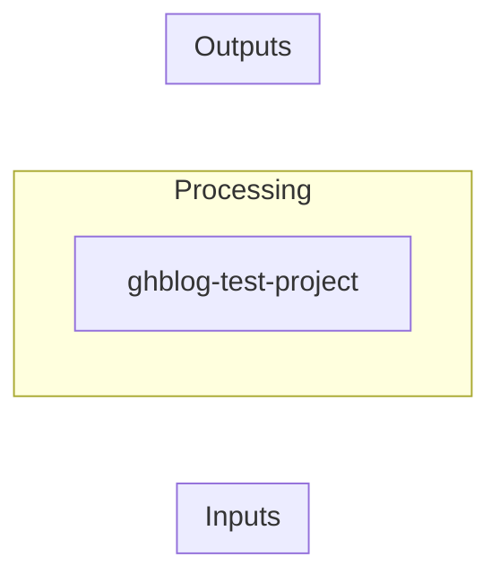

# ghblog-test-project

Test project for ghblog-agent new-repo pipeline

---

## Overview

A throwaway test project that exercises the full ghblog-agent pipeline end-to-end: new repo creation, docs generation from the project template, git commit and push, and GitHub Pages deployment. This repo will be deleted after validation.

---

## Architecture

### Inputs

### Outputs

### Dependencies
_None specified_

### Data Flow

---

## Code References

_None provided_

---

## Provenance

| Field | Value |
|-------|-------|
| Hermes Run ID | preflight-2026-06-08-001 |
| Payload Hash | 4af79d85dbd94e26ecbdb30574daf8360222021df6560d1148569d50cd785846 |
| Source Path | /home/hermes/workspace/ghblog-agent |
| Published At | 2026-06-08T12:30:00Z |
| Kind | project |
| Destination | new_repo |