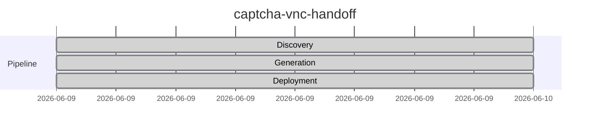

# captcha-vnc-handoff

Automated CAPTCHA detection with VNC-based human handoff for headless browser workflows

## Status

## Repository

[GitHub](https://github.com/joewpb/captcha-vnc-handoff)

---

*Generated by ghblog-agent v1.0 &mdash; Provenance: 2026-06-09 &mdash; captcha-vnc-handoff*
