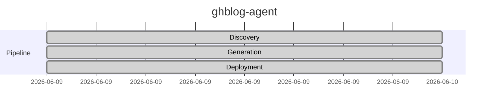

# ghblog-agent

Autonomous GitHub Pages publishing agent with 5-phase pipeline, Jekyll theming, and verification gate

## Status

## Repository

[GitHub](https://github.com/joewpb/ghblog-agent)

---

*Generated by ghblog-agent v1.0 &mdash; Provenance: 2026-06-09 &mdash; ghblog-agent*
