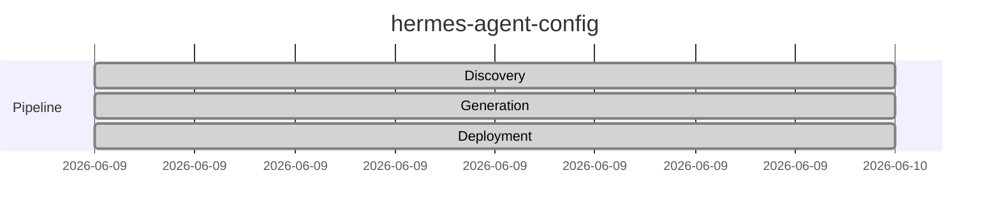

# hermes-agent-config

Hermes agent infrastructure with 17 swarm agents across 18 profiles, self-hosted on Tailscale

## Status

## Repository

[GitHub](https://github.com/joewpb/hermes-agent-config)

---

*Generated by ghblog-agent v1.0 &mdash; Provenance: 2026-06-09 &mdash; hermes-agent-config*
