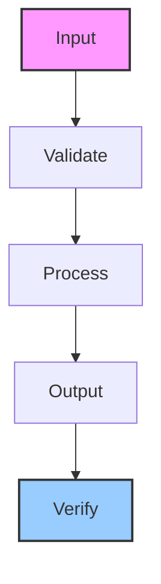

# agent-state-machine

Pattern for building strict-phase state machine agents with validation, routing, and checkpoint handoff

## Architecture

## Usage

This skill is part of the Hermes agent ecosystem. Load it with `skill_view(name='agent-state-machine')` to access full instructions.

---

*Generated by ghblog-agent v1.0 &mdash; Provenance: 2026-06-09 &mdash; agent-state-machine*
