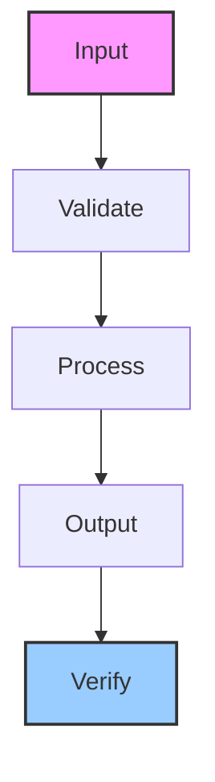

# captcha-watcher

Detects CAPTCHAs during automated browsing and triggers VNC handoff for human solving

## Architecture

## Usage

This skill is part of the Hermes agent ecosystem. Load it with `skill_view(name='captcha-watcher')` to access full instructions.

---

*Generated by ghblog-agent v1.0 &mdash; Provenance: 2026-06-09 &mdash; captcha-watcher*
