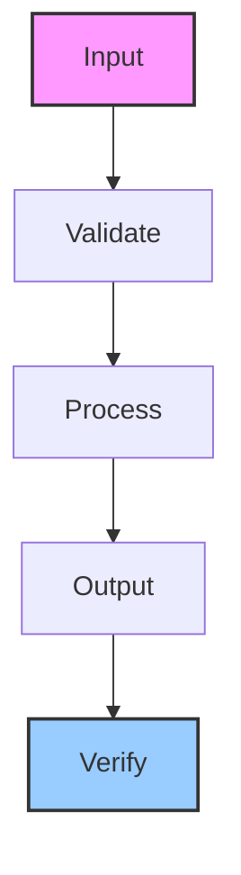

# content-agent-core

Swarm content agent for multi-platform publishing (X, LinkedIn, Facebook, Instagram) and feed monitoring

## Architecture

## Usage

This skill is part of the Hermes agent ecosystem. Load it with `skill_view(name='content-agent-core')` to access full instructions.

---

*Generated by ghblog-agent v1.0 &mdash; Provenance: 2026-06-09 &mdash; content-agent-core*
