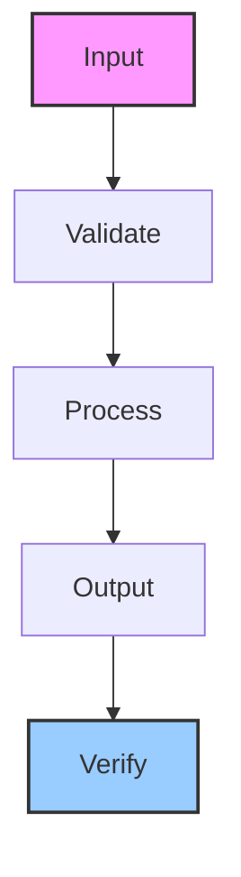

# data-pipeline-core

Swarm data pipeline agent for ETL workflows, file processing, and format conversion

## Architecture

## Usage

This skill is part of the Hermes agent ecosystem. Load it with `skill_view(name='data-pipeline-core')` to access full instructions.

---

*Generated by ghblog-agent v1.0 &mdash; Provenance: 2026-06-09 &mdash; data-pipeline-core*
