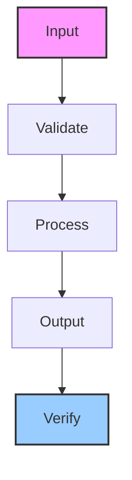

# devops-agent-core

Swarm devops agent for deployments, Docker management, service health checks, and backups

## Architecture

## Usage

This skill is part of the Hermes agent ecosystem. Load it with `skill_view(name='devops-agent-core')` to access full instructions.

---

*Generated by ghblog-agent v1.0 &mdash; Provenance: 2026-06-09 &mdash; devops-agent-core*
