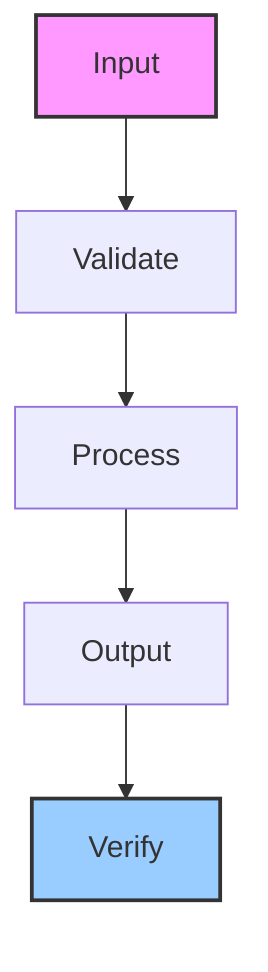

# github-page-publisher

5-phase autonomous pipeline that runs discovery, generates markdown with Jekyll frontmatter, and deploys to GitHub Pages

## Architecture

## Usage

This skill is part of the Hermes agent ecosystem. Load it with `skill_view(name='github-page-publisher')` to access full instructions.

---

*Generated by ghblog-agent v1.0 &mdash; Provenance: 2026-06-09 &mdash; github-page-publisher*
