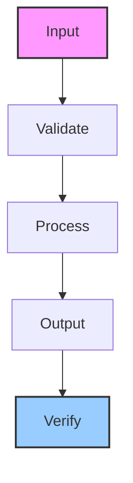

# publishing-agent-core

GitHub Pages publishing agent for creating repos, generating docs, and deploying artifact sites

## Architecture

## Usage

This skill is part of the Hermes agent ecosystem. Load it with `skill_view(name='publishing-agent-core')` to access full instructions.

---

*Generated by ghblog-agent v1.0 &mdash; Provenance: 2026-06-09 &mdash; publishing-agent-core*
